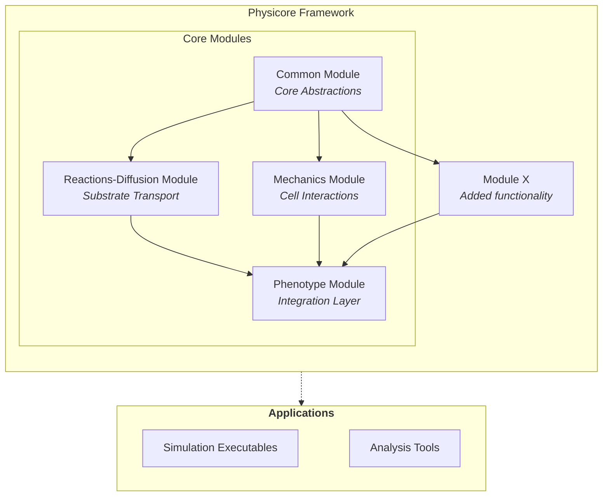

# Architecture

PhysiCore is designed with modularity and extensibility at its core. This page explains the logical structure and how different components interact to create a flexible multicellular simulation framework.

## Design Philosophy

PhysiCore follows several key architectural principles:

1. **Time-scale separation** - Physics processes are organized by their characteristic time scales
2. **Pluggable implementations** - Each module supports multiple backend implementations
3. **Clear interfaces** - Public APIs are stable and well-defined via CMake `FILE_SET HEADERS`
4. **Self-registering components** - Implementations register themselves at startup for runtime selection
5. **Performance-first** - Ready for HPC, vectorization, and GPU acceleration


## Terminology

Understanding PhysiCore's architecture requires familiarity with several key terms that describe different levels of abstraction:

1. Module
    1. Its Implementation
        1. Its Execution Kernel

### Module

A **module** represents a distinct physics domain or time scale in multicellular simulations. Modules define the contract and interface that implementations must follow, but contain no concrete algorithms themselves.

Examples:
- `reactions-diffusion` - Handles substrate transport and reaction kinetics
- `mechanics` - Manages cell-cell and cell-substrate mechanical interactions  
- `phenotype` - Integrates modules and defines biological behaviors

Modules are organized as separate CMake libraries under their own directories (e.g., `reactions-diffusion/`, `mechanics/`).

### Module Implementations

**Module implementations** (also called **models** or **engines**) provide concrete algorithms and data structures that fulfill a module's interface contract. Multiple implementations can exist for the same module, offering different algorithmic approaches or trade-offs.

Examples:
- `biofvm` - A finite volume implementation of the reactions-diffusion module
- `micromechanics` - A spring-based implementation of the mechanics module
- `physicore` - The reference implementation of the phenotype module

Each implementation lives in its own subdirectory within the module (e.g., `reactions-diffusion/biofvm/`, `mechanics/micromechanics/`).

### Kernels and Solvers

**Kernels** (also called **solvers** or **backends**) are hardware-specific implementations of the computational core within a module implementation. They provide the same algorithm but optimized for different execution environments.

Examples:
- `openmp_solver` - CPU parallelization using OpenMP threads
- `thrust_solver` - GPU/CPU parallelization using NVIDIA Thrust
- `cuda_solver` - Direct GPU acceleration using CUDA

Kernels self-register with registries (like `solver_registry`) at static initialization, enabling runtime selection without compile-time dependencies. They are located in `kernels/` subdirectories within implementations (e.g., `reactions-diffusion/biofvm/kernels/openmp_solver/`).

The distinction between **kernel** and **solver** is subtle:
- **Solver** emphasizes the algorithmic approach (finite volume solver, finite element solver)
- **Kernel** emphasizes the execution backend (OpenMP kernel, CUDA kernel)

PhysiCore uses "kernel" to highlight that these components provide alternative execution strategies for the same underlying algorithm.


## Architecture Overview

PhysiCore is organized into **modules** based on the time scale and physics domain they represent. Each module defines a contract (interface) that multiple **implementations** can provide.



### Core Modules

PhysiCore consists of four primary modules:

| Module | Purpose | Location |
|--------|---------|----------|
| **common** | Core abstractions, types, and interfaces | `common/` |
| **reactions-diffusion** | Substrate diffusion and reaction kinetics | `reactions-diffusion/` |
| **mechanics** | Cell-cell and cell-substrate mechanical interactions | `mechanics/` |
| **phenotype** | Phenotype models and simulation wiring | `phenotype/` |

## Module Hierarchy

### Common Module

The `common` module provides the foundational abstractions that all other modules build upon:

**Key Components:**
- `timestep_executor` - Defines the simulation loop contract
- `base_agent` - Agent data structures using structure-of-arrays (SoA) pattern
- `base_agent_container` - Container for managing agent collections
- Core types and concepts for type safety

**Namespace:** `physicore::common`

**Location:** `common/include/common/`

The `timestep_executor` is the central abstraction:
```cpp
class timestep_executor {
    virtual void run_single_timestep() = 0;
    virtual void serialize_state(real_t current_time) = 0;
};
```

All simulation components implement this interface to participate in the main simulation loop.

### Reactions-Diffusion Module

Handles substrate transport and reaction kinetics on timescales of seconds to minutes.

**Implementations:**
- **BioFVM** - Finite volume method for reaction-diffusion PDEs

**Namespace:** `physicore::reactions-diffusion::biofvm`

**Location:** `reactions-diffusion/biofvm/`

**Features:**
- 3D Cartesian mesh discretization
- Multiple substrates with independent diffusion coefficients
- Source/sink terms from cell secretion and uptake
- Dirichlet boundary conditions

### Mechanics Module

Handles cell-cell and cell-substrate mechanical interactions on timescales of minutes to hours.

**Implementations:**
- **Micromechanics** - Spring-based mechanics with repulsion and adhesion forces

**Namespace:** `physicore::mechanics::micromechanics`

**Location:** `mechanics/micromechanics/`

**Features:**
- Spring-based cell-cell interactions
- Cell-cell repulsion when overlapping
- Cell-cell adhesion forces
- Boundary force models

### Phenotype Module

Integrates the diffusion and mechanics modules into complete simulations and defines cell phenotype behaviors.

**Implementations:**
- **PhysiCore Phenotype** - Reference phenotype implementation

**Namespace:** `physicore::phenotype::physicore`

**Location:** `phenotype/physicore/`

## Implementation Pattern

Each module can have multiple **implementations** (also called **models** or **engines**). For example:
- The reactions-diffusion module has the **BioFVM** implementation
- The mechanics module has the **micromechanics** implementation

Implementations provide concrete algorithms while adhering to the module's interface contract.

### Directory Structure of an Implementation

Using BioFVM as an example:

```
reactions-diffusion/biofvm/
├── include/              # Public API headers
│   └── biofvm/
│       ├── solver.h
│       └── microenvironment.h
├── src/                  # Implementation files
│   ├── solver.cpp
│   └── microenvironment.cpp
├── kernels/              # Backend-specific implementations
│   ├── openmp_solver/
│   └── thrust_solver/
├── examples/             # Demonstration applications
│   └── diffuse.cpp
└── tests/                # Unit tests
    └── solver_test.cpp
```

## Kernel Implementations

Within each implementation, **kernels** (also called **solvers** or **backends**) provide hardware-specific optimizations. Kernels are the lowest level of the hierarchy and execute the actual computational work.

### What are Kernels?

Kernels are specialized implementations of core algorithms optimized for different hardware or parallelization strategies:

- **OpenMP Solver** - CPU parallelization using OpenMP threads
- **Thrust Solver** - GPU/CPU parallelization using NVIDIA Thrust library with TBB backend
- **CUDA Solver** (planned) - Direct GPU acceleration using CUDA

### Self-Registration Pattern

Kernels self-register with the `solver_registry` at static initialization time. This enables runtime selection without hard-coding dependencies.

**Example:** BioFVM diffusion solvers

```
reactions-diffusion/biofvm/kernels/
├── openmp_solver/
│   ├── include/
│   │   └── biofvm/kernels/openmp_solver/
│   │       └── diffusion_solver.h
│   └── src/
│       ├── diffusion_solver.cpp
│       └── register_solver.cpp     # Self-registration code
└── thrust_solver/
    ├── include/
    │   └── biofvm/kernels/thrust_solver/
    │       └── diffusion_solver.h
    └── src/
        ├── diffusion_solver.cpp
        └── register_solver.cpp     # Self-registration code
```

**Registration Example:**

Each kernel implements a registration unit (e.g., `register_solver.cpp`):

```cpp
// In openmp_solver/src/register_solver.cpp
#include <biofvm/solver_registry.h>
#include "diffusion_solver.h"

namespace {
    // Self-registers at static initialization
    auto registered = biofvm::registry_adder<OpenMPDiffusionSolver>("openmp");
}
```

The main application then selects a solver at runtime:

```cpp
auto solver = solver_registry::instance().get("openmp");
// or
auto solver = solver_registry::instance().get("thrust");
```

### Why Kernels vs Solvers?

The terms **kernel** and **solver** are sometimes used interchangeably, but have subtle differences:

- **Solver** emphasizes the algorithmic approach (e.g., finite volume solver, finite element solver)
- **Kernel** emphasizes the computational backend (e.g., OpenMP kernel, CUDA kernel)

In PhysiCore, we use **kernel** for the hardware-specific implementations because:
1. The algorithm (e.g., finite volume) is defined by the implementation (BioFVM)
2. Kernels provide alternative execution strategies for the same algorithm
3. The term aligns with GPU computing terminology

## Module Communication

Modules interact through well-defined interfaces:

1. **Diffusion → Mechanics**: Substrate concentrations influence cell behavior
2. **Mechanics → Diffusion**: Cell positions determine source/sink terms
3. **Phenotype**: Coordinates both modules and implements biological rules

```
┌─────────────────────────────────────────┐
│           Phenotype Layer               │
│  (Coordinates simulation, biology)      │
└───────────────┬─────────────────────────┘
                │
       ┌────────┴────────┐
       │                 │
┌──────▼──────┐   ┌──────▼──────┐
│  Diffusion  │   │  Mechanics  │
│   Module    │◄──┤   Module    │
└─────────────┘   └─────────────┘
  Concentrations    Cell Positions
```

## Public vs Internal APIs

PhysiCore maintains a clear distinction between public and internal interfaces:

### Public API
- **Location:** `*/include/` directories
- **Export:** Via CMake `FILE_SET HEADERS` 
- **Stability:** Stable across minor versions
- **Usage:** Consumed by downstream code and other modules

### Internal Implementation
- **Location:** `*/src/` directories
- **Visibility:** Private to the module
- **Stability:** May change without notice
- **Usage:** Implementation details, not for external use

## Namespace Organization

PhysiCore uses nested namespaces to organize code:

```cpp
physicore::common           // Core abstractions
physicore::reactions-diffusion::biofvm         // BioFVM module
physicore::reactions-diffusion::biofvm::kernels::openmp    // OpenMP kernel
physicore::reactions-diffusion::biofvm::kernels::thrust    // Thrust kernel
physicore::mechanics::micromechanics           // Micromechanics module
physicore::phenotype::physicore                // Phenotype integration
```

## Build System Integration

Each module is a separate CMake library with:
- Namespace alias: `physicore::module::name`
- Public headers exported via `FILE_SET HEADERS`
- Dependencies on `physicore::common` and required external libraries

**Example CMake usage:**
```cmake
# Link against BioFVM
target_link_libraries(my_simulation PRIVATE physicore::reactions-diffusion::biofvm)

# Automatically includes public headers from:
# - physicore::common
# - physicore::reactions-diffusion::biofvm
```

## Summary

The PhysiCore architecture provides:

1. **Modularity** - Clear separation between diffusion, mechanics, and phenotype
2. **Extensibility** - Add new implementations without modifying existing code
3. **Flexibility** - Choose different kernels at runtime
4. **Performance** - Hardware-specific optimizations via specialized kernels
5. **Maintainability** - Clean interfaces and namespace organization

This design enables researchers to focus on science while benefiting from high-performance numerical methods and modern software engineering practices.
