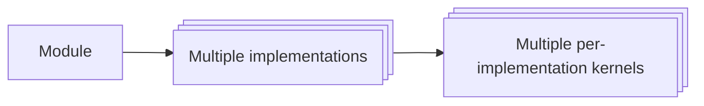
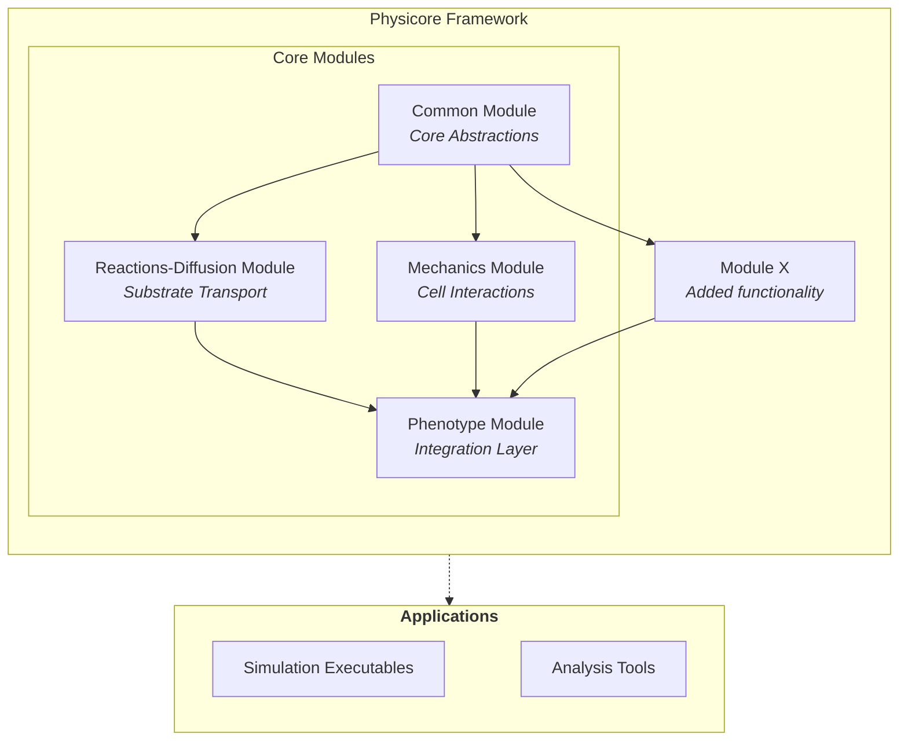

# Architecture

PhysiCore is designed with modularity and extensibility at its core. This page explains the logical structure and how different components interact to create a flexible multicellular simulation framework.

## Design Philosophy

PhysiCore follows several key architectural principles:

1. **Time-scale separation** - Physics processes are organized by their characteristic time scales
2. **Pluggable implementations** - Each module supports multiple backend implementations
3. **Clear interfaces** - Public APIs are stable and well-defined via CMake `FILE_SET HEADERS`
4. **Self-registering components** - Implementations register themselves at startup for runtime selection
5. **Performance-first** - Ready for HPC, vectorization, and GPU acceleration


## Terminology

Understanding PhysiCore's architecture requires familiarity with several key terms that describe different levels of abstraction: **module**, **module implementation**, and **kernel**.



### Module

A **module** represents a distinct physics domain or time scale in multicellular simulations. Modules define the contract and interface that implementations must follow, but contain no concrete algorithms themselves.

Examples:
- `reactions-diffusion` - Handles substrate transport and reaction kinetics
- `mechanics` - Manages cell-cell and cell-substrate mechanical interactions
- `phenotype` - Integrates modules and defines biological behaviors

Modules are organized as separate CMake libraries under their own directories (e.g., `reactions-diffusion/`, `mechanics/`).

### Module Implementations

**Module implementations** (also called **models** or **engines**) provide concrete algorithms and data structures that fulfill a module's interface contract. Multiple implementations can exist for the same module, offering different algorithmic approaches or trade-offs.

Examples:
- `biofvm` - A finite volume implementation of the reactions-diffusion module
- `micromechanics` - A spring-based implementation of the mechanics module
- `physicore` - The reference implementation of the phenotype module

Each implementation lives in its own subdirectory within the module (e.g., `reactions-diffusion/biofvm/`, `mechanics/micromechanics/`).

### Kernels and Solvers

**Kernels** (also called **solvers** or **backends**) are hardware-specific implementations of the computational core within a module implementation. They provide the same algorithm but optimized for different execution environments.

Examples:
- `openmp_solver` - CPU parallelization using OpenMP threads
- `thrust_solver` - GPU/CPU parallelization using NVIDIA Thrust
- `cuda_solver` - Direct GPU acceleration using CUDA

Kernels self-register with registries (like `solver_registry`) at static initialization, enabling runtime selection without compile-time dependencies. They are located in `kernels/` subdirectories within implementations (e.g., `reactions-diffusion/biofvm/kernels/openmp_solver/`).

The distinction between **kernel** and **solver** is subtle:
- **Solver** emphasizes the algorithmic approach (finite volume solver, finite element solver)
- **Kernel** emphasizes the execution backend (OpenMP kernel, CUDA kernel)

PhysiCore uses "kernel" to highlight that these components provide alternative execution strategies for the same underlying algorithm.


## Architecture Overview

PhysiCore is organized into **modules** based on the time scale and physics domain they represent. Each module defines a contract (interface) that multiple **implementations** can provide.



### Core Modules

PhysiCore consists of four primary modules:

| Module | Purpose | Location |
|--------|---------|----------|
| **common** | Core abstractions, types, and interfaces | `common/` |
| **reactions-diffusion** | Substrate diffusion and reaction kinetics | `reactions-diffusion/` |
| **mechanics** | Cell-cell and cell-substrate mechanical interactions | `mechanics/` |
| **phenotype** | Phenotype models and simulation wiring | `phenotype/` |

Currently, these modules cover the essential physics for multicellular simulations. Additional modules can be added to extend functionality.

So far, PhysiCore implements *common* functionality and the *reactions-diffusion* module via the **BioFVM** implementation.

👉 **[Learn more about the Common Module](Architecture-Common.md)**

<!-- 👉 **[Learn more about the Reactions-Diffusion Module](Architecture-Diffusion.md)** -->

## Directory Structure of an Implementation

As you know, each module can have multiple *implementations*. Each implementation follows a consistent directory structure to separate public APIs, internal implementations, kernels, examples, and tests.

Using BioFVM as an example:

```
reactions-diffusion/biofvm/
├── include/              # Public API headers
│   └── biofvm/
│       ├── solver.h
│       └── microenvironment.h
├── src/                  # Implementation files and private headers
│   ├── solver.cpp
│   ├── config_reader.h
│   ├── config_reader.cpp
│   └── microenvironment.cpp
├── kernels/              # Backend-specific implementations
│   ├── openmp_solver/
│   └── thrust_solver/
├── examples/             # Demonstration applications
│   └── diffuse.cpp
└── tests/                # Unit tests
    └── solver_test.cpp
```

<!-- ### Public vs Internal APIs

PhysiCore maintains a clear distinction between public and internal interfaces:

#### Public API
- **Location:** `*/include/` directories
- **Export:** Via CMake `FILE_SET HEADERS`
- **Stability:** Stable across minor versions
- **Usage:** Consumed by downstream code and other modules

#### Internal Implementation
- **Location:** `*/src/` directories
- **Visibility:** Private to the module
- **Stability:** May change without notice
- **Usage:** Implementation details, not for external use

## Namespace Organization

PhysiCore uses nested namespaces to organize code:

```cpp
physicore::common           // Core abstractions
physicore::reactions-diffusion::biofvm         // BioFVM module
physicore::reactions-diffusion::biofvm::kernels::openmp    // OpenMP kernel
physicore::reactions-diffusion::biofvm::kernels::thrust    // Thrust kernel
physicore::mechanics::micromechanics           // Micromechanics module
physicore::phenotype::physicore                // Phenotype integration
```

## Build System Integration

Each module is a separate CMake library with:
- Namespace alias: `physicore::module::name`
- Public headers exported via `FILE_SET HEADERS`
- Dependencies on `physicore::common` and required external libraries

**Example CMake usage:**
```cmake
# Link against BioFVM
target_link_libraries(my_simulation PRIVATE physicore::reactions-diffusion::biofvm)

# Automatically includes public headers from:
# - physicore::common
# - physicore::reactions-diffusion::biofvm
``` -->

## Next Steps

Explore each module in detail:

- **[Common Module](Architecture-Common.md)** - Core abstractions, timestep executors, and agent containers

<!-- - **[Reactions-Diffusion Module](Architecture-Diffusion.md)** - Substrate transport and reaction kinetics
- **[Mechanics Module](Architecture-Mechanics.md)** - Cell-cell and cell-substrate mechanical interactions
- **[Phenotype Module](Architecture-Phenotype.md)** - Integration layer and biological behaviors -->

