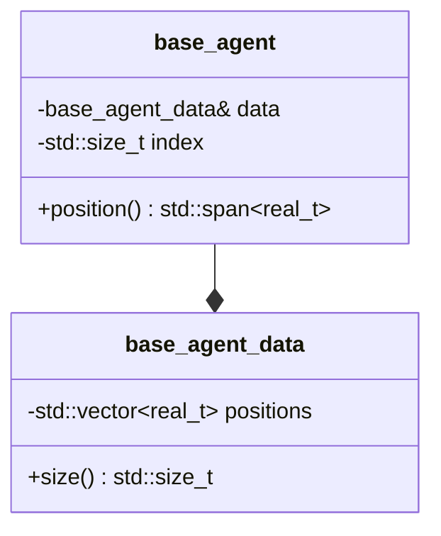

# Common Module
{: .no_toc }

The `common` module provides the foundational abstractions that all other PhysiCore modules build upon. It defines core interfaces, data structures, and types that enable modular simulation design.

## Table of Contents
{: .no_toc .text-delta }

1. TOC
{:toc}

---

## Overview

The Common module establishes the contracts and base types that enable PhysiCore's modular architecture. Every other module depends on Common, making it the foundation of the framework.

**Namespace:** `physicore::common`

**Location:** `common/include/common/`

**Key Responsibilities:**
- Define the simulation loop contract via `timestep_executor`
- Provide agent data structures using structure-of-arrays (SoA) pattern
- Manage agent collections through containers
- Establish core types and concepts for type safety

## The `timestep_executor` Interface

The `timestep_executor` is the central abstraction that defines how simulation components participate in the main simulation loop.

### Interface Definition

```cpp
namespace physicore::common {

class timestep_executor {
public:
    virtual ~timestep_executor() = default;

    // Execute a single timestep of the simulation
    virtual void run_single_timestep() = 0;

    // Serialize current simulation state
    virtual void serialize_state(real_t current_time) = 0;
};

} // namespace physicore::common
```

### Design Rationale

All simulation components (diffusion solvers, mechanics engines, phenotype models) implement this interface, enabling:

1. **Uniform simulation loop** - The main loop doesn't need to know implementation details
2. **Composability** - Multiple executors can be orchestrated together
3. **Testability** - Each component can be tested in isolation
4. **Extensibility** - New modules automatically integrate with existing infrastructure

### Usage Example

```cpp
#include <common/timestep_executor.h>

class DiffusionSolver : public physicore::common::timestep_executor {
public:
    void run_single_timestep() override {
        // Solve reaction-diffusion PDE for one timestep
        compute_diffusion();
        apply_reactions();
        update_concentrations();
    }

    void serialize_state(real_t current_time) override {
        // Write substrate concentrations to VTK files
        vtk_writer.write(current_time, substrate_data);
    }
};
```

## Agent Data Structures

PhysiCore uses a **structure-of-arrays (SoA)** pattern for agent data to enable efficient vectorization and cache-friendly memory access.

### Structure-of-Arrays (SoA) Pattern

Instead of storing agent data as an array of structures (AoS):

```cpp
// Array-of-Structures (AoS) - NOT used in PhysiCore
struct Agent {
    double x, y, z;      // Position
    double vx, vy, vz;   // Velocity
    double radius;
    int type;
};
std::vector<Agent> agents;  // Poor cache locality
```

PhysiCore uses structure-of-arrays (SoA):

```cpp
// Structure-of-Arrays (SoA) - Used in PhysiCore
struct AgentData {
    std::vector<double> positions;        // Positions of all agents
    std::vector<double> velocities;     // Velocities of all agents
    std::vector<double> radii;
    std::vector<int> types;
};
```

**Benefits:**
- **Vectorization** - SIMD operations process contiguous data efficiently
- **Cache efficiency** - Related data is stored together
- **Memory bandwidth** - Fewer cache misses during computation
- **Parallelization** - Easy to partition across threads/GPUs

The `base_agent_data` class provides the foundational SoA storage for all agents in the simulation by defining *an array of positions*.


### The `base_agent` Proxy

To provide object-like access to individual agents while maintaining SoA storage, PhysiCore uses a **proxy pattern** via the `base_agent` class:

```cpp
namespace physicore::common {

class base_agent {
    base_agent_data& data;
    std::size_t index;
public:
    // Constructor takes reference to data and index
    base_agent(base_agent_data& data, std::size_t index);

    // Access position
    std::span<real_t> position() { /* accesses SoA data using its index */ }
};

} // namespace physicore::common
```

**Key relationships:**
- `base_agent_data` owns the SoA storage (positions array)
- `base_agent` holds a reference to the data and an index
- `base_agent::position()` accesses the data using its index to provide object-like interface




<!-- ## Agent Containers

The `base_agent_container` provides high-level management of agent collections:

```cpp
namespace physicore::common {

class base_agent_container {
public:
    // Add a new agent
    base_agent create_agent(real_t x, real_t y, real_t z);

    // Access agent by index
    base_agent operator[](std::size_t index);

    // Iterate over all agents
    auto begin();
    auto end();

    // Get number of agents
    std::size_t size() const;

    // Remove agent
    void remove(std::size_t index);

private:
    base_agent_data data_;
};

} // namespace physicore::common
```

**Usage Example:**

```cpp
#include <common/base_agent_container.h>

base_agent_container container;

// Create agents
auto agent1 = container.create_agent(0.0, 0.0, 0.0);
auto agent2 = container.create_agent(1.0, 1.0, 1.0);

// Iterate and modify
for (auto agent : container) {
    real_t x = agent.position_x();
    agent.set_velocity_x(x * 0.1);
}
``` -->

## Core Types

The Common module defines fundamental types used throughout PhysiCore:

```cpp
namespace physicore::common {

// Real number type (double precision)
using real_t = double;
// Unsigned and signed index types
using index_t = std::uint64_t;
using sindex_t = std::int64_t;

} // namespace physicore::common
```

These types ensure consistency and portability across modules and a single place of modification if we want to change precision later.

## File Organization

The Common module follows PhysiCore's public/private API separation:

```
common/
├── include/
│   └── common/              # Public API headers
│       ├── timestep_executor.h
│       ├── base_agent.h
│       ├── base_agent_data.h
│       ├── base_agent_container.h
│       ├── base_agent_interface.h
│       ├── generic_agent_container.h
│       ├── generic_agent_solver.h
│       ├── concepts.h
│       └── types.h
├── src/                     # Private implementation (if needed)
└── tests/
    ├── test_base_agent.cpp
    ├── test_base_agent_data.cpp
    └── test_base_agent_container.cpp
```

## Public API Stability

Headers in `common/include/common/` are exported via CMake `FILE_SET HEADERS` and constitute the **stable public API**. These interfaces are maintained across minor versions with semantic versioning guarantees.

## Dependencies

The Common module has minimal external dependencies:
- C++20 standard library
- No external libraries required

This makes it the lightest-weight component and suitable as a foundation for all other modules.

<!-- ## Next Steps

Learn how the Common module interfaces are used in specific physics domains:

- **[Reactions-Diffusion BioFVM Implementation](BioFVM.md)** - Uses `timestep_executor` for diffusion solvers -->
