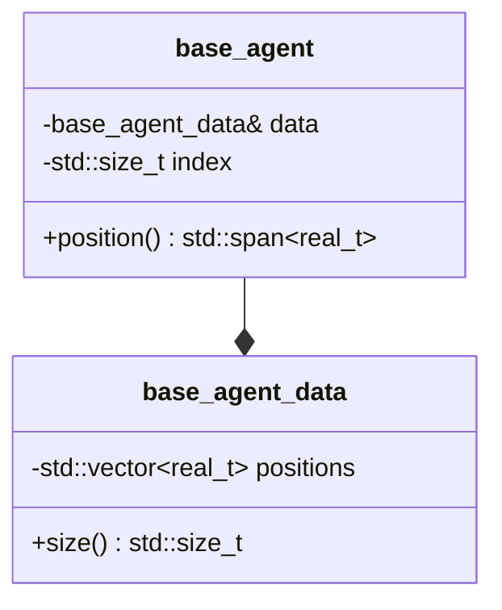
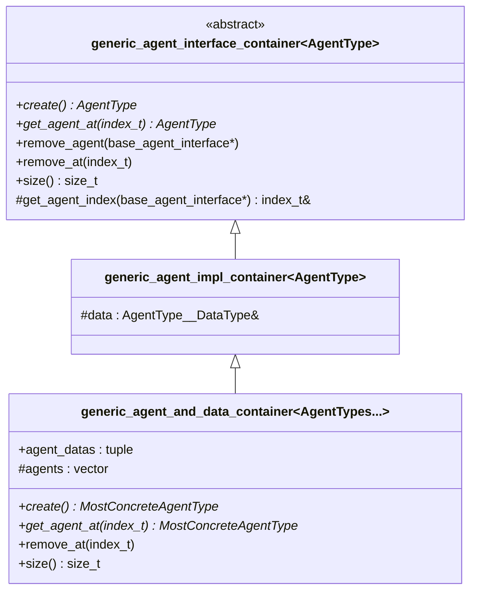
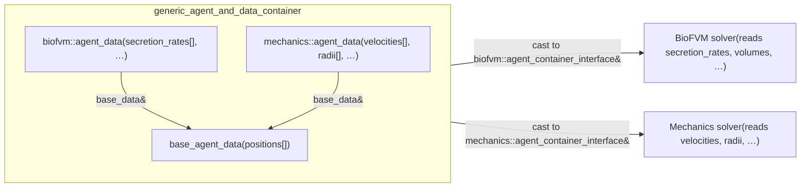

# Common Module
{: .no_toc }

The `common` module provides the foundational abstractions that all other PhysiCore modules build upon. It defines core interfaces, data structures, and types that enable modular simulation design.

## Table of Contents
{: .no_toc .text-delta }

1. TOC
{:toc}

---

## Overview

The Common module establishes the contracts and base types that enable PhysiCore's modular architecture. Every other module depends on Common, making it the foundation of the framework.

**Namespace:** `physicore::common`

**Location:** `common/include/common/`

**Key Responsibilities:**
- Define the simulation loop contract via `timestep_executor`
- Provide agent data structures using structure-of-arrays (SoA) pattern
- Manage agent collections through containers
- Establish core types and concepts for type safety

## The `timestep_executor` Interface

The `timestep_executor` is the central abstraction that defines how simulation components participate in the main simulation loop.

### Interface Definition

```cpp
namespace physicore::common {

class timestep_executor {
public:
    virtual ~timestep_executor() = default;

    // Execute a single timestep of the simulation
    virtual void run_single_timestep() = 0;

    // Serialize current simulation state
    virtual void serialize_state(real_t current_time) = 0;
};

} // namespace physicore::common
```

### Design Rationale

All simulation components (diffusion solvers, mechanics engines, phenotype models) implement this interface, enabling:

1. **Uniform simulation loop** - The main loop doesn't need to know implementation details
2. **Composability** - Multiple executors can be orchestrated together
3. **Testability** - Each component can be tested in isolation
4. **Extensibility** - New modules automatically integrate with existing infrastructure

### Usage Example

```cpp
#include <common/timestep_executor.h>

class DiffusionSolver : public physicore::common::timestep_executor {
public:
    void run_single_timestep() override {
        // Solve reaction-diffusion PDE for one timestep
        compute_diffusion();
        apply_reactions();
        update_concentrations();
    }

    void serialize_state(real_t current_time) override {
        // Write substrate concentrations to VTK files
        vtk_writer.write(current_time, substrate_data);
    }
};
```

## Agent Data Structures

PhysiCore uses a **structure-of-arrays (SoA)** pattern for agent data to enable efficient vectorization and cache-friendly memory access.

### Structure-of-Arrays (SoA) Pattern

Instead of storing agent data as an array of structures (AoS):

```cpp
// Array-of-Structures (AoS) - NOT used in PhysiCore
struct Agent {
    double x, y, z;      // Position
    double vx, vy, vz;   // Velocity
    double radius;
    int type;
};
std::vector<Agent> agents;  // Poor cache locality
```

PhysiCore uses structure-of-arrays (SoA):

```cpp
// Structure-of-Arrays (SoA) - Used in PhysiCore
struct AgentData {
    std::vector<double> positions;        // Positions of all agents
    std::vector<double> velocities;     // Velocities of all agents
    std::vector<double> radii;
    std::vector<int> types;
};
```

**Benefits:**
- **Vectorization** - SIMD operations process contiguous data efficiently
- **Cache efficiency** - Related data is stored together
- **Memory bandwidth** - Fewer cache misses during computation
- **Parallelization** - Easy to partition across threads/GPUs

The `base_agent_data` class provides the foundational SoA storage for all agents in the simulation by defining *an array of positions*.


### The `base_agent` Proxy

To provide object-like access to individual agents while maintaining SoA storage, PhysiCore uses a **proxy pattern** via the `base_agent` class:

```cpp
namespace physicore::common {

class base_agent {
    base_agent_data& data;
    std::size_t index;
public:
    // Constructor takes reference to data and index
    base_agent(base_agent_data& data, std::size_t index);

    // Access position
    std::span<real_t> position() { /* accesses SoA data using its index */ }
};

} // namespace physicore::common
```

**Key relationships:**
- `base_agent_data` owns the SoA storage (positions array)
- `base_agent` holds a reference to the data and an index
- `base_agent::position()` accesses the data using its index to provide object-like interface


```mermaid
classDiagram
    class base_agent_data {
        -std::vector~real_t~ positions
        +size() std::size_t
    }

    class base_agent {
        -base_agent_data& data
        -std::size_t index
        +position() std::span~real_t~
    }

    base_agent --* base_agent_data
```


## Agent Containers

The agent container system manages collections of agents, owns their SoA data, and provides type-safe access. The implementation is built entirely from templates in `common/include/common/generic_agent_container.h`.

### Template Hierarchy

Three layers form a clean separation of concerns:


```mermaid
classDiagram
    class generic_agent_interface_container~AgentType~ {
        <<abstract>>
        +create() AgentType*
        +get_agent_at(index_t) AgentType*
        +remove_agent(base_agent_interface*)
        +remove_at(index_t)
        +size() size_t
        #get_agent_index(base_agent_interface*) index_t&
    }

    class generic_agent_impl_container~AgentType~ {
        #data : AgentType__DataType&
    }

    class generic_agent_and_data_container~AgentTypes...~ {
        +agent_datas : tuple
        #agents : vector
        +create() MostConcreteAgentType*
        +get_agent_at(index_t) MostConcreteAgentType*
        +remove_at(index_t)
        +size() size_t
    }

    generic_agent_interface_container <|-- generic_agent_impl_container
    generic_agent_impl_container <|-- generic_agent_and_data_container
```

**Layer 1 — `generic_agent_interface_container<AgentType>`**

The abstract interface any container exposes. Constrained by the `derived_from_base_agent` concept, requiring `AgentType` to inherit from `base_agent_interface`. This is the contract that solvers and other consumers depend on — they never see the concrete container type.

**Layer 2 — `generic_agent_impl_container<AgentType>`**

Holds a typed, non-owning reference (`AgentType::DataType&`) to the underlying SoA data. This layer is the injection point: the reference is provided in the constructor and lets `generic_agent_solver` extract the data from a polymorphic container at runtime.

**Layer 3 — `generic_agent_and_data_container<AgentTypes...>`**

The concrete, data-owning container. It is variadic — it accepts any number of agent types and owns one `std::unique_ptr<DataType>` for each in a `std::tuple`. The last type in the parameter pack is the **most-concrete agent type** (the type actually instantiated for each agent object). It inherits from `generic_agent_impl_container<T>` for every `T` in the pack, making it queryable as any of those interface types.

### Lifecycle Operations

**Creating an agent** (`create()`):

```cpp
MostConcreteAgentType* create() override
{
    // 1. Grow every data array by one element
    (std::get<std::unique_ptr<typename AgentTypes::DataType>>(agent_datas)->add(), ...);
    // 2. Construct a proxy whose index == current size (before push)
    auto new_agent = std::make_unique<MostConcreteAgentType>(this->size(), agent_datas);
    agents.emplace_back(std::move(new_agent));
    return agents.back().get();
}
```

`create()` is the only way to obtain a valid agent pointer. The returned raw pointer is owned by the container — callers must not `delete` it.

**Removing an agent** (`remove_at(index_t position)`):

Removal runs in O(1) using a **swap-with-last** strategy:

1. Call `remove_at(position)` on every data array (also swap-with-last inside each SoA)
2. Fix up the index of the last agent's proxy (now moved to `position`)
3. Swap `agents[position]` with `agents.back()`
4. Pop the last element

This avoids any memory shifting. It invalidates the index of the agent that was previously at the last position (its index is now `position`), but all proxy references remain valid because the heap-allocated proxy object itself was not moved.

### `base_agent_container` — the Simplest Case

For contexts that only need to track positions (e.g., unit tests or a pure geometry pass):

```cpp
// common/include/common/base_agent_container.h
using base_agent_container = generic_agent_and_data_container<base_agent>;
```

```cpp
#include <common/base_agent_container.h>

physicore::base_agent_container container(
    std::make_unique<physicore::base_agent_data>(3 /*dims*/));

physicore::base_agent* a1 = container.create();
physicore::base_agent* a2 = container.create();

a1->position()[0] = 10.0;  // set x of agent 1

container.remove_agent(a1);  // O(1), a2 is now at index 0
```

---

### Sharing Base Agent Data Across Containers

A central design goal of PhysiCore is that **positions (and other common agent attributes) are stored exactly once**, yet are accessible to every physics module (diffusion, mechanics, phenotype). The key idea is:

- There is **one** `generic_agent_and_data_container` that owns all data.
- Each domain-specific data structure (`biofvm::agent_data`, `mechanics::agent_data`, …) holds a **non-owning reference** to `base_agent_data` — there is never a copy of positions.
- Because the container inherits from `generic_agent_impl_container<T>` for every type in its pack, it can be **implicitly cast** to any module's `container_interface` type and used independently by each module.


```mermaid
graph LR
    subgraph container["generic_agent_and_data_container"]
        direction TB
        bd["base_agent_data(positions[])"]
        dd["biofvm::agent_data(secretion_rates[], …)"]
        md["mechanics::agent_data(velocities[], radii[], …)"]
        dd -- "base_data&" --> bd
        md -- "base_data&" --> bd
    end

    container -- "cast to biofvm::agent_container_interface&" --> BioFVM
    container -- "cast to mechanics::agent_container_interface&" --> Mechanics

    BioFVM["BioFVM solver(reads secretion_rates, volumes, …)"]
    Mechanics["Mechanics solver(reads velocities, radii, …)"]
```

#### How the Reference Stays Valid

`generic_agent_and_data_container` owns every data object as a `unique_ptr` in a `std::tuple`. Domain data is constructed **before** ownership is transferred, so the reference each domain data struct holds into `base_agent_data` is already pointing at the final, stable heap address:

```cpp
// Constructing biofvm::agent_container (pack: base_agent, biofvm::agent)
auto base_data = std::make_unique<physicore::base_agent_data>(3 /*dims*/);
auto diff_data = std::make_unique<physicore::biofvm::agent_data>(*base_data, 5 /*substrates*/);
//   ^^^^^^^^^ diff_data.base_data now points at *base_data on the heap

physicore::biofvm::agent_container container(std::move(base_data), std::move(diff_data));
// container owns both unique_ptrs; diff_data.base_data reference remains valid forever
```

The same pattern applies for every additional domain added to the pack. `biofvm::agent_container` is the existing real-world example:

```cpp
// reactions-diffusion/biofvm/include/biofvm/agent_container.h
using agent_container           = physicore::generic_agent_and_data_container<base_agent, agent>;
using agent_container_interface = physicore::generic_agent_interface_container<agent_interface>;
using container_ptr             = std::shared_ptr<agent_container_interface>;
```

| Position in pack | `AgentType` | `DataType` | Owns data? |
|---|---|---|---|
| 0 | `base_agent` | `base_agent_data` | Yes — positions |
| 1 | `biofvm::agent` | `biofvm::agent_data` | Yes — holds `base_data&` |

#### Extending to a Second Domain (Conceptual)

Adding a second domain follows the same pattern: define an `agent_data` struct with a `base_agent_data&` reference, a concrete `agent` type (last in the pack), and widen the `generic_agent_and_data_container` parameter pack. The resulting container can be implicitly cast to the `container_interface` of any domain in the pack and used independently by each module's solver.

A self-contained working example of this — with a `diffusion_agent`, a `mechanics_agent`, and a combined `big_agent` that satisfies both interfaces — is in [`common/tests/test_base_agent_container.cpp`](https://github.com/bsc-life/PhysiCore/blob/main/common/tests/test_base_agent_container.cpp) (test `BaseAgentContainerTest.Instantiation`). The key parts of that test:

```cpp
// One container owns all four data objects
generic_agent_and_data_container<base_agent, diffusion_agent, mechanics_agent, big_agent> container(
    std::move(base_data), std::move(diffusion_data), std::move(mechanics_data), std::move(big_data));

// Implicitly cast to either module's interface — no extra container needed
generic_agent_interface_container<diffusion_agent_interface>& diffusion_view = container;
generic_agent_interface_container<mechanics_agent_interface>& mechanics_view  = container;

// Both views stay in sync: create() through one is visible through the other
mechanics_view.create();
ASSERT_EQ(diffusion_view.size(), 1);  // true

diffusion_view.create();
ASSERT_EQ(mechanics_view.size(), 2);  // true
```

---

## `generic_agent_solver` — Typed Data Extraction

Solvers receive containers through polymorphic `container_ptr` (or a `container_interface&`) references. They need the concrete, typed `DataType&` to perform computations. `generic_agent_solver` bridges this gap safely:

```cpp
// common/include/common/generic_agent_solver.h
template <derived_from_base_agent AgentType>
class generic_agent_solver
{
public:
    typename AgentType::DataType& retrieve_agent_data(
        generic_agent_interface_container<typename AgentType::InterfaceType>& container)
    {
        auto& casted = dynamic_cast<generic_agent_impl_container<AgentType>&>(container);
        return casted.data;
    }
};
```

**Usage inside a solver:**

```cpp
// Inside a BioFVM solver that holds a container_ptr
void biofvm_solver::run_single_timestep() {
    physicore::generic_agent_solver<physicore::biofvm::agent> accessor;
    physicore::biofvm::agent_data& data = accessor.retrieve_agent_data(*container_);
    // data.secretion_rates, data.volumes, etc. are now directly accessible
}
```

The `dynamic_cast` is safe because any object implementing `generic_agent_interface_container<agent_interface>` is always constructed as a `generic_agent_and_data_container<base_agent, agent>`, which inherits from `generic_agent_impl_container<biofvm::agent>` — the type relationship is established at construction time.

## Core Types

The Common module defines fundamental types used throughout PhysiCore:

```cpp
namespace physicore::common {

// Real number type (double precision)
using real_t = double;
// Unsigned and signed index types
using index_t = std::uint64_t;
using sindex_t = std::int64_t;

} // namespace physicore::common
```

These types ensure consistency and portability across modules and a single place of modification if we want to change precision later.

## File Organization

The Common module follows PhysiCore's public/private API separation:

```
common/
├── include/
│   └── common/              # Public API headers
│       ├── timestep_executor.h
│       ├── base_agent.h
│       ├── base_agent_data.h
│       ├── base_agent_container.h
│       ├── base_agent_interface.h
│       ├── generic_agent_container.h
│       ├── generic_agent_solver.h
│       ├── concepts.h
│       └── types.h
├── src/                     # Private implementation (if needed)
└── tests/
    ├── test_base_agent.cpp
    ├── test_base_agent_data.cpp
    └── test_base_agent_container.cpp
```

## Public API Stability

Headers in `common/include/common/` are exported via CMake `FILE_SET HEADERS` and constitute the **stable public API**. These interfaces are maintained across minor versions with semantic versioning guarantees.

## Dependencies

The Common module has minimal external dependencies:
- C++20 standard library
- No external libraries required

This makes it the lightest-weight component and suitable as a foundation for all other modules.

<!-- ## Next Steps

Learn how the Common module interfaces are used in specific physics domains:

- **[Reactions-Diffusion BioFVM Implementation](BioFVM.md)** - Uses `timestep_executor` for diffusion solvers -->
